# IIC3752 - Tarea Final: Visualización Datos BCN

## Descripción

La solución diseñada corresponde a la Tarea Final para el curso IIC3752 Tecnologias para Inteligencia de Negocios. Esta busca resolver la necesidad de la Biblioteca del Congreso Nacional de desarrollar un sistema de gestión institucional que le permita visualizar estadísticas de información de los servicios de asesoria generados a los parlamentarios, además de información de estadísticas de créditos otorgados por el fondo fogape. 
A diferencia del proyecto final entregado anteriormente, esta tarea es una solución de Inteligencia de Negocios realizada completamente mediante el uso de herramientas de Microsoft. En particular el uso de Azure, tanto por su capacidad de almacenamiento con el servicio de base de datos, como por su herramienta para ocupar un Data Factory, y luego el uso de PowerBI como herramienta de analisis y visualización de datos.

## Solución Implementada

Para cumplir con los requerimientos de esta tarea, se utilizó la plataforma Azure, donde se utilizó Data Factory para procesar los archivos csv que extraen información desde la página del fogape, se procesan y cargan en el servicio Base de Datos, que utilizamos para consolidar nuestros datos en Azure. Ademas se extrajeron los datos detallados de servicios de información realizados a parlamentarios, por los asesores de la BCN. De esta forma consolidamos un datawarehouse en Azure con todos los datos recuperados. Finalmente realizamos visualizaciones utilizando PowerBI, de las cuales se incluyen print screen en la carpeta `/images` de este repositorio.

Se crearon 2 archivos de visualizaciones en PowerBI, cuyos archivos se subieron a la carpeta `/powerbi_views` de este repositorio, desde donde pueden ser descargados y ejecutados para acceder a las visualizaciones construidas.

## Uso de la plataforma Azure

Para el uso de la plataforma Azure es necesario que se le otorge permiso al usuario para acceder a los recursos creados. Para esta entrega utilizamos la cuenta de Azure de uno de los integrantes del grupo, y resulta simple transferir la propiedad de los recursos a otro usuario administrador para la Biblioteca del Congreso Nacional si es deseado. Luego, se podrá acceder al Data Factory y Base de Datos y StorageBlob creados.

Una vez establecido el uso de la plataforma Azure, es posible acceder las visualizaciones y los analisis realizados en Power BI Desktop mediante una cuenta y los archivos encontrados en la carpeta `/powerbi_views`. Es posible que se pida reingresar los datos de autenticacion para acceder a la base de datos.

El siguiente diagrama representa la arquitectura de azure, desde el Storage Blob, pasando por el Data Factory, luego almacenando los datos en las tablas y finalmente consumiendolos en Power BI para su analisis.

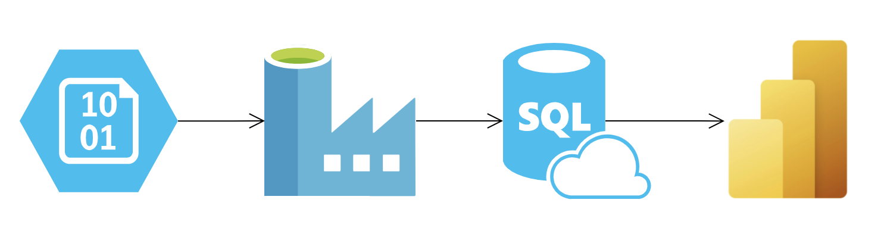

## Proceso de Trabajo

### Azure 

Para empezar con la recolección de datos, utilizamos los csv obtenidos desde el crawler entregado para el proyecto final. Por lo tanto, para efectos de esta entrega, utilizaremos los csv obtenidos y asumiremos que tenemos como obtener sus actualizaciones desde los crawlers ya creados. Estos csv se pueden encontrar en la carpeta `/csvs` y corresponden a los datos extraidos del fogape.

Estos archivos deben almacenarse en alguna cuenta de almacenamiento, por lo que creamos un recurso de Blob Storage, donde eventualmente podriamos automatizar la extracción del crawler. Sin embargo, por ahora simplemente es un espacio para almacenar los archivos csv obtenidos.

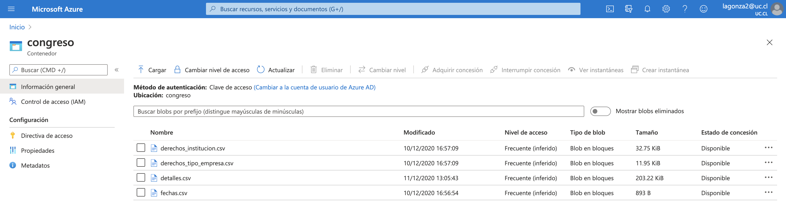

Por otro lado, necesitamos crear el recurso del Servidor de Azure Database for PostgreSQL. Acá se ubicará nuestra Base de Datos y resulta importante definir los permisos necesarios para que se pueda acceder desde distintas herramientas.

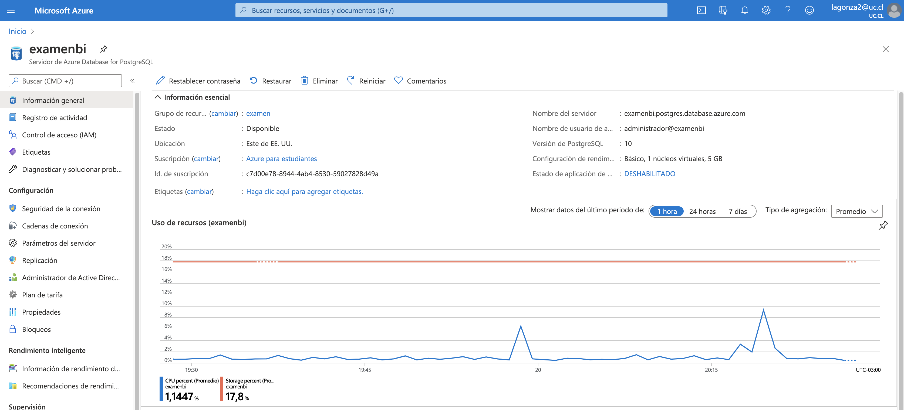

Luego, procedimos a crear un recurso de Data Factory para gestionar la integración de los datos extraidos. Para esto fue necesario crear 4 pipelines, correspondientes a cada tabla creada en la base de datos. Cada pipeline requiere de Datasets que le permitan ubicar los archivos csv y ubicar las tablas donde estos deben ser insertados. Luego, cada pipeline se encarga de monitorear el proceso de integración, con la finalidad de estandarizar, uniformar y automatizar la forma en que los datos son recolectados.

Si en un futuro los datos entregados muestran irregularidades, es acá donde se podran uniformar y estandarizar. Sin embargo, actualmente el crawler soluciona los principales aspectos de integración ya que no eran muy complicados de uniformar. Es por esto que los pipelines solamente son compuestos por un recurso de Copy Data.

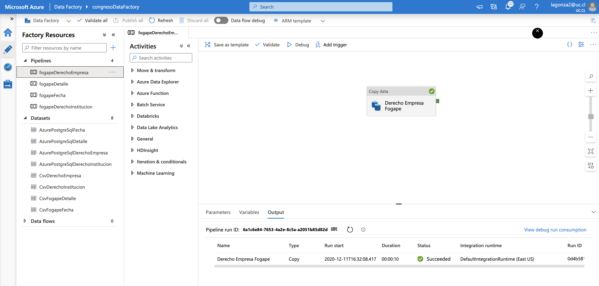

Además, aprovechamos de crear un trigger para las pipelines. Esto automatiza parte del proceso de integración, ya que cada semana buscará los archivos csv del Blob Storage y integrara los datos en la Base de Datos deseada mientras se monitorea el proceso.

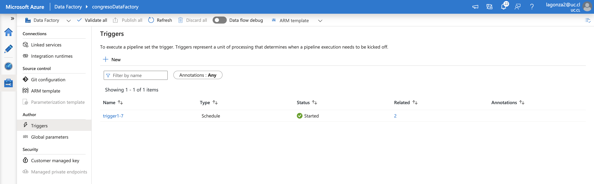

### Power BI

Una vez almacenados los datos, podemos avanzar al analisis de los datos desde nuestra herramienta seleccionada. Si se desea visualizar los archivos especificos, es posible encontrarlos en la carpeta `/powerbi_views` como ya se mencionó anteriormente. Sin embargo, a continuación se presentan pantallazos de las vistas obtenidas.

#### Fogape

Los datos obtenidos del fogape nos permiten visualizar los siguientes diagramas.

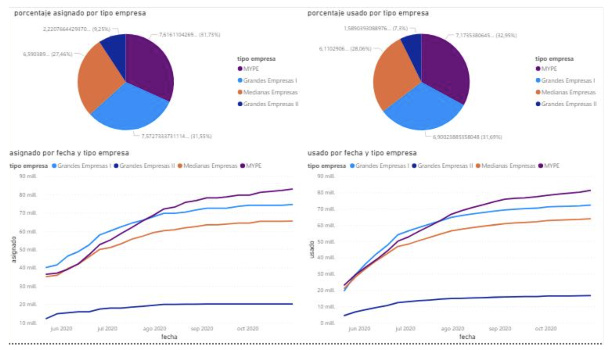
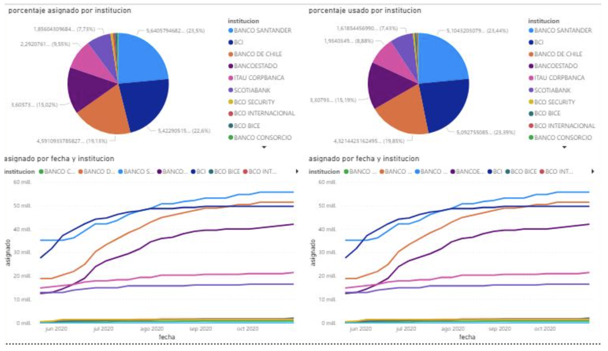
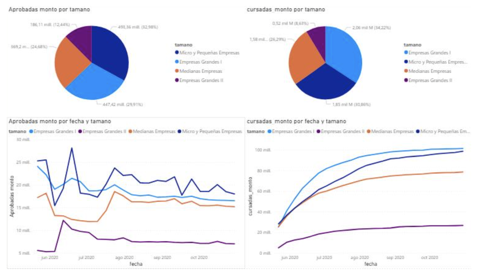
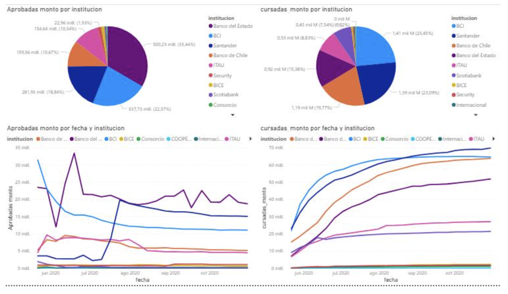
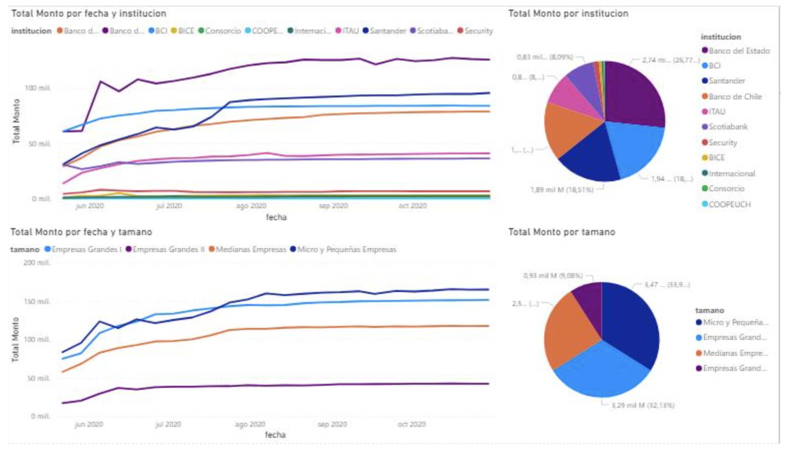

#### Servicios a Parlamentarios

Los datos obtenidos de Servicios a Parlamentarios nos permiten visualizar los siguientes diagramas.

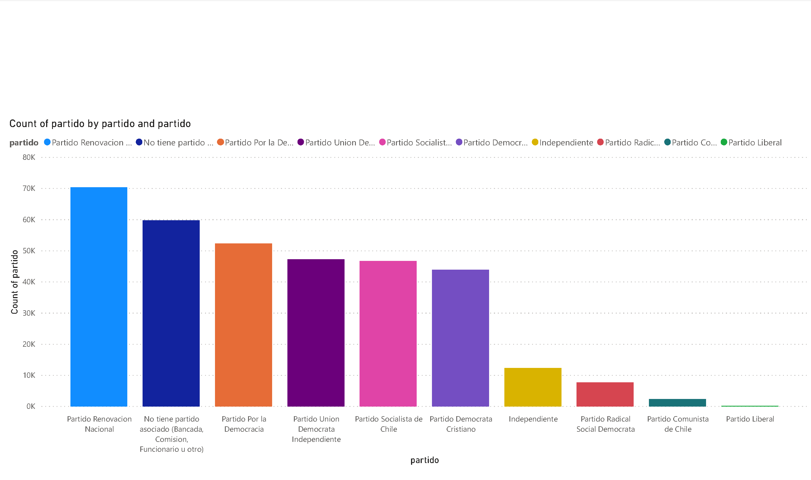
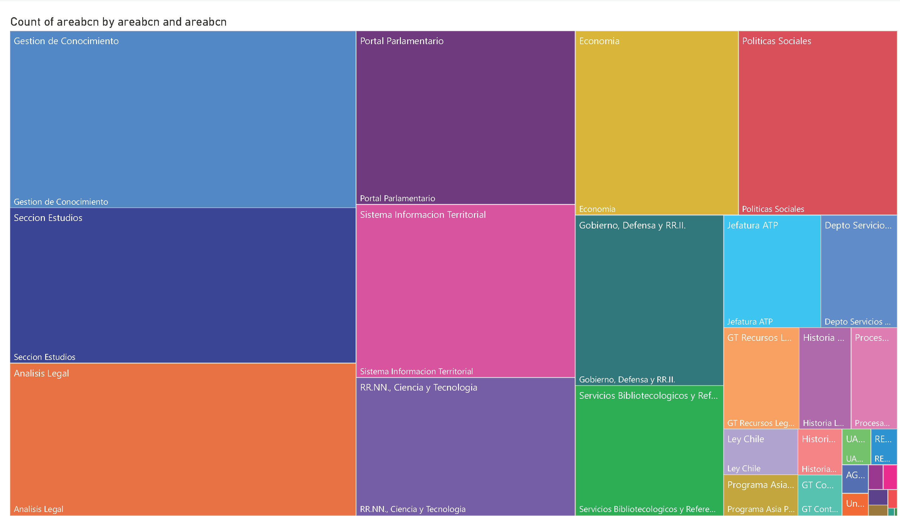
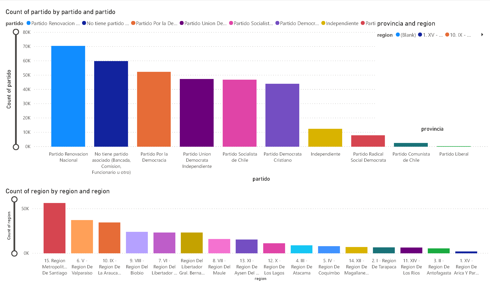
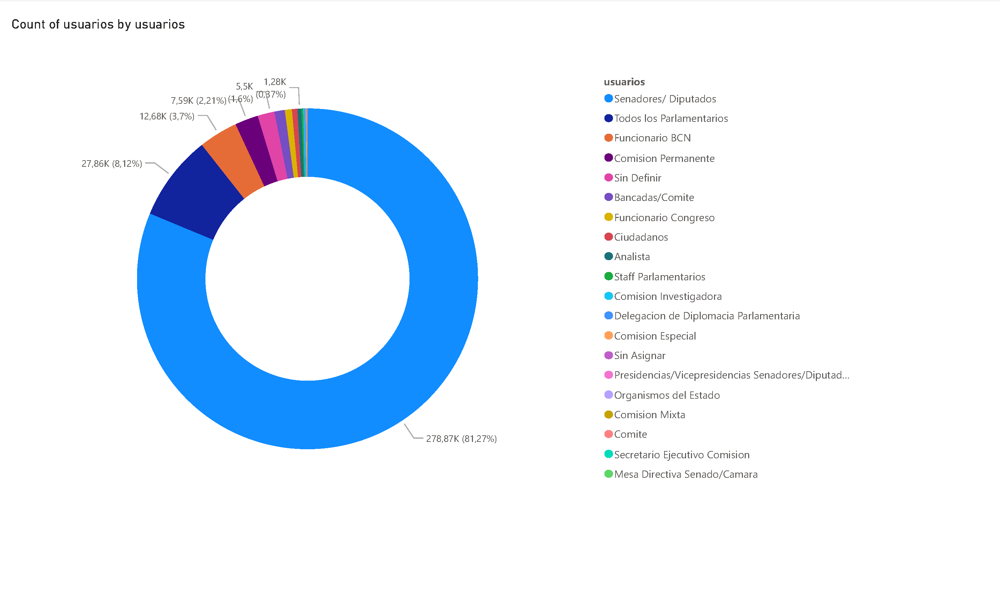
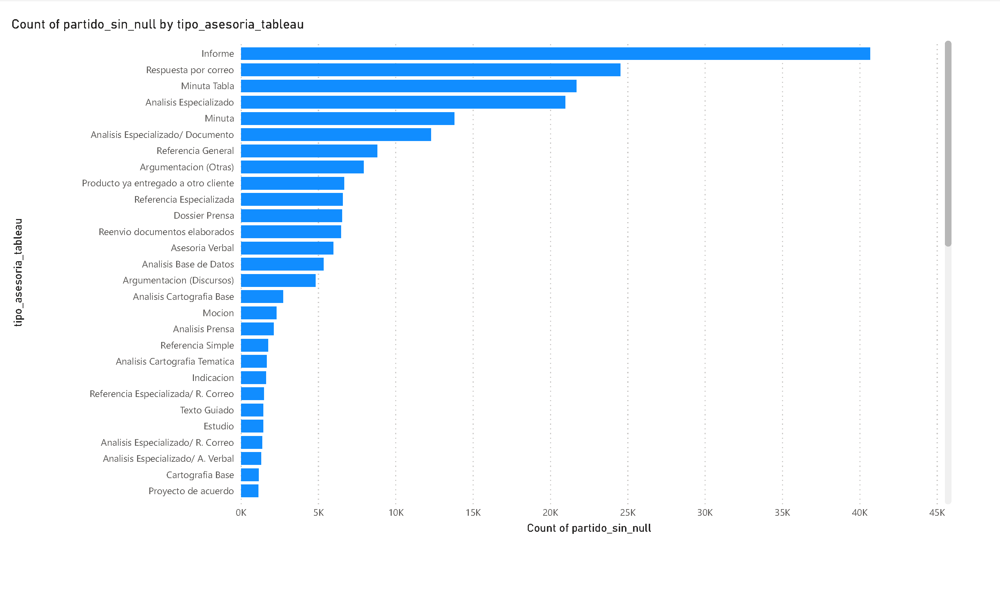
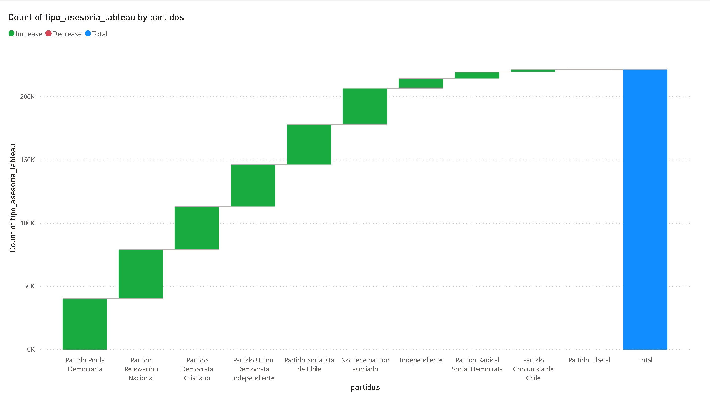
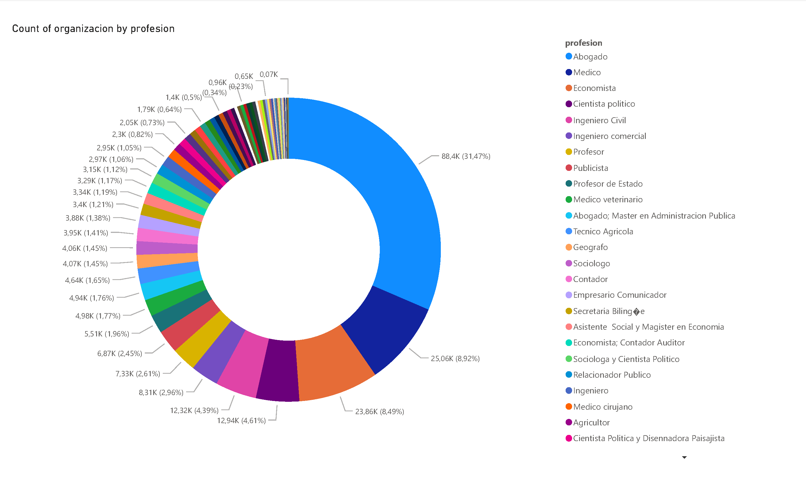

#### Conclusiones

Esta tarea se realizó exitosamente, ya que se logró cumplir con la meta de replicar el trabajo que ya realizamos para el cliente BCN, quien requirió la construcción de visualizaciones en Tableau, para información de estadísticas de servicios a parlamentarios, y de créditos fogape.

Ahora, con el objetivo de implementar dichas visualizaciones, haciendo uso de la plataforma Azure y sus herramientas, logramos implementar procesamiento de ETL con Data Factory para procesar los datos y almacenarlos en el servicio de Base de Datos y finalmente se construyó un conjunto de visualizaciones con PowerBI.

Como conclusión académica podemos indicar que fue una experiencia importante, donde pudimos aplicar los conceptos vistos en el curso, a la implementación de una solución para un cliente de la vida real, logrando el desarrollo exitoso de las actividades requeridas.
